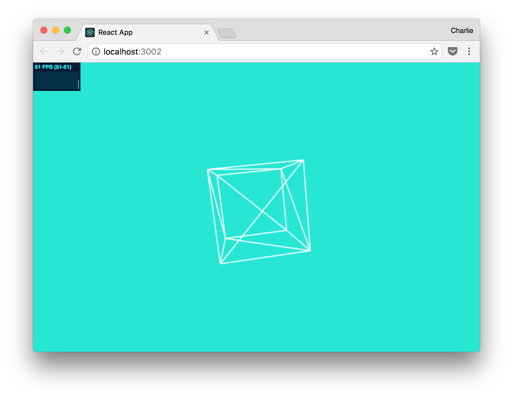
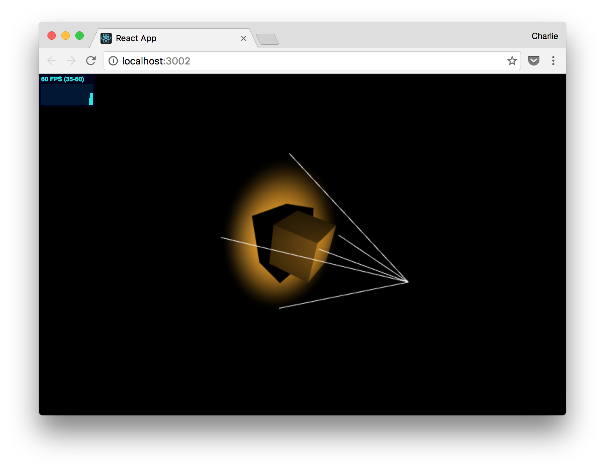
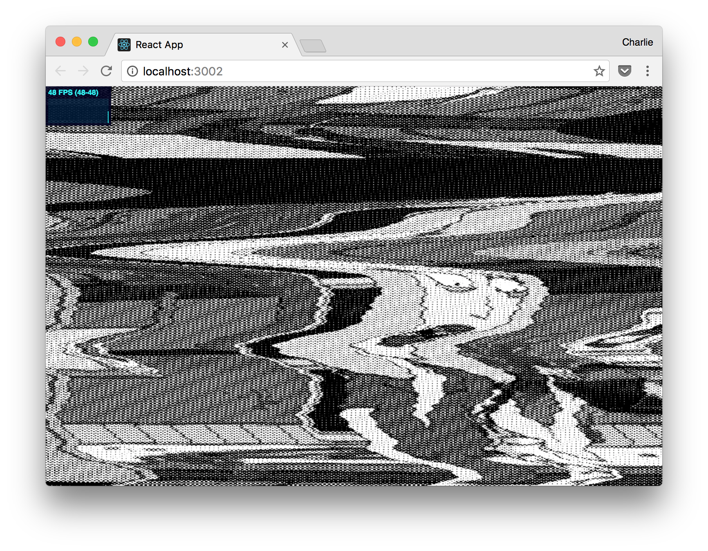

 

# React + Three Playground

R3, or React and Three.js, is a series of playgrounds and demos highlighting many of the features and capabilities of WebGL. It covers simple objects, textures and lighting, all the way to custom shaders, framebuffers and video. It benefits from hot reloading, Webpack, and ES6 support out of the box.

It is set up to accept a single video, either by passing a video URL via the `video` query string (for example, [http://localhost:3002/?video=https://media.giphy.com/media/3o6Zti8Yz88sqW1nq0/giphy.mp4](http://localhost:3000/?video=https://media.giphy.com/media/3o6Zti8Yz88sqW1nq0/giphy.mp4)) or by using the `webcam` query string (with http://localhost:3000/?webcam=true). If neither are present, the app will fall back to using a video file, in `video/video.mp4`.

You can also see how React could be used in tandem with the Three.js canvas element, which can be activated with the `overlay` query string. [http://localhost:3000/?overlay=true](http://localhost:3000/?overlay=true).

To view different playgrounds, edit the `Playground` import in `App.js`. For example, to view Playground 01:

`import Playground from './playgrounds/01'`

Though each playground showcases a different feature, shaders can be interchanged simply by changing the Shader variable that is imported. There is no need to change the settings / uniforms passed to the shaders. Unless you want to. In which case, go for it, you!

- [Playground 01](#playground-01) - Geometry
- [Playground 02](#playground-02) - Light And Shadow
- [Playground 03](#playground-03) - Video And Texture
- [Playground 04](#playground-04) - Single Shader
- [Playground 05](#playground-05) - Multi-Pass Shader
- [Texture]()
---

### Playground 01
## Geometry

`import Playground from './playgrounds/01'`

- Navigable by mouse

A wireframe box, floating in space.

---

### Playground 02
## Light And Shadow

`import Playground from './playgrounds/02'`

- Navigable by mouse

A cube that accepts light and casts shadows.

---

### Playground 03
## Video And Texture

`import Playground from './playgrounds/03'`

- Navigable by mouse
- Accepts one shader
- Perspective camera

A shaded texture on a box geometry, floating in space, with a cube that accepts light.

---

### Playground 04
## Single Shader

`import Playground from './playgrounds/04'`

A flat display, with a single shader on a video texture.

- Accepts one shader
- Orthonographic camera

---

### Playground 05
## Multi-Pass Shader

`import Playground from './playgrounds/05'`

A flat display, with a two shaders on a video texture.

- Accepts two shaders via a framebuffer
- Orthonographic Camera

---

## Why?
This repo was written for a workshop at Decompress 2016, in Melbourne, Australia.

## A note on React
Though this app is built on [Create React App](https://github.com/facebookincubator/create-react-app), it keeps a distinct line between React and Three. This allows for the benefits of React and Webpack without an overcomplicated architecture. There are many projects that support a more tightly integrated relationship between React and Three.js, like [React Three Renderer](https://github.com/toxicFork/react-three-renderer) and [React Three](https://github.com/Izzimach/react-three), and you should definetely check them out.

## Create React App

This project was bootstrapped with [Create React App](https://github.com/facebookincubator/create-react-app).

You can find the most recent documentation for using create-react-app [here](https://github.com/facebookincubator/create-react-app/blob/master/packages/react-scripts/template/README.md).
